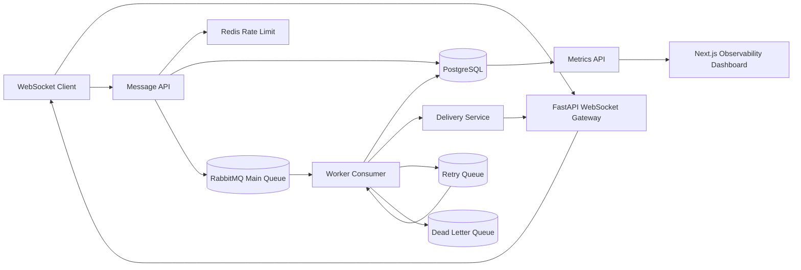

# QueuePulse


A production-style distributed messaging infrastructure simulator with WebSockets, queueing, retries, DLQ, metrics, and observability.

QueuePulse is a production-grade distributed messaging simulator designed to make the backend mechanics behind Slack and WhatsApp-style systems visible. It demonstrates WebSockets, async queueing, retries, dead-letter handling, idempotency, delivery guarantees, PostgreSQL persistence, Redis-backed rate limiting, shared runtime controls, and a polished observability dashboard.

Portfolio description: QueuePulse simulates the backend infrastructure behind real-time messaging platforms, focusing on reliability, retry handling, delivery guarantees, and operational visibility.

This is built as a recruiter-ready systems project: the UI is approachable, but the core value is the message pipeline, operational behavior, and architecture story.

## Why This Is Not A Normal Chat App

The chat UI is only the producer and receiver. The real project is the backend pipeline:

- Client submissions are persisted with `client_message_id` idempotency.
- Messages receive room-level `sequence_number` ordering.
- RabbitMQ buffers work between the API and workers.
- Workers implement at-least-once processing, retry attempts, exponential backoff, and DLQ handoff.
- PostgreSQL records messages, status events, and delivery attempts.
- Redis tracks presence, quick counters, and per-user rate limits.
- The dashboard exposes queue depth, retry pressure, DLQ count, delivery latency, throughput, and failure rate.

## Architecture



## Message Lifecycle

1. User sends a message from `/chat`.
2. API validates the room and user, applies Redis rate limiting, and checks `(room_id, client_message_id)`.
3. API assigns the next room sequence number and persists a `queued` message.
4. Message ID is published to RabbitMQ.
5. Worker consumes the event, simulates delivery, writes `delivery_attempts`, and emits status events.
6. Successful messages become `delivered` and are broadcast over WebSocket.
7. Failed messages retry with exponential backoff.
8. Messages exceeding max retries are marked `dead_lettered` and published to DLQ.

## Delivery Guarantees

QueuePulse models at-least-once delivery. Duplicate submissions are safe because `client_message_id` is unique per room. Consumers are idempotent: delivered/read/dead-lettered messages are not processed again.

## Database Schema

- `users`
- `rooms`
- `room_members`
- `room_sequences`
- `messages`
- `message_status_events`
- `delivery_attempts`

## Local Setup

### Run Without Docker

Use this mode when Docker, WSL, RabbitMQ, or Redis are unavailable. QueuePulse keeps the same API and UI behavior, but runs as a local simulation:

- SQLite replaces PostgreSQL.
- In-memory queues replace RabbitMQ.
- In-memory presence, rate limiting, and runtime controls replace Redis.
- FastAPI starts a local background worker so messages move from `queued` to `delivered` during demos.

Backend:

```bash
cd backend
python -m venv .venv
.venv\Scripts\activate
pip install -r requirements.txt
uvicorn app.main:app --reload --port 8000
```

Frontend:

```bash
cd frontend
npm install
npm run dev
```

Open:

- Frontend: http://localhost:3000
- Backend health: http://localhost:8000/health

For local mode, `.env` is optional because defaults are already local-first. To be explicit:

```bash
cp .env.example .env
```

### Run With Docker

Docker mode uses the real infrastructure profile: PostgreSQL, Redis, RabbitMQ, FastAPI backend, worker, and Next.js frontend.

```bash
cp .env.example .env
docker compose up --build
```

Services:

- Frontend: http://localhost:3000
- Backend: http://localhost:8000
- RabbitMQ UI: http://localhost:15672 (`guest` / `guest`)

## Verification Commands

Local no-Docker verification:

```bash
cd backend
pip install -r requirements.txt
python -m compileall app
python -m pytest app/tests
uvicorn app.main:app --reload --port 8000
```

Frontend verification:

```bash
cd frontend
npm install
npm run build
npm run dev
```

Docker verification:

```bash
docker compose config
docker compose up --build
curl http://localhost:8000/health
python scripts/load_test.py --users 50 --messages 500 --room demo
```

Current verification: local backend import, syntax check, health endpoint, local message delivery smoke test, backend tests, frontend production build, and `docker compose config` have passed. Full `docker compose up --build` is not required for no-Docker demo mode and may be blocked on machines with unstable WSL.

For local frontend development:

```bash
cd frontend
npm install
npm run dev
```

For local backend development:

```bash
cd backend
python -m venv .venv
. .venv/bin/activate
pip install -r requirements.txt
uvicorn app.main:app --reload
python -m app.workers.consumer
```

In no-Docker local mode, the separate worker command is optional because FastAPI starts an in-memory background worker automatically. In Docker mode, the dedicated worker container processes RabbitMQ messages.

## Demo Script

1. Open `/dashboard` and note baseline metrics.
2. Open `/chat`, choose a room, and send messages.
3. Return to `/dashboard` and observe throughput and latency.
4. Set failure rate to `40%`.
5. Send more traffic or run the load test.
6. Watch retries, failures, and dead-letter count increase.
7. Resume normal delivery with failure rate `0%`.

For a more detailed walkthrough, see [docs/DEMO_SCRIPT.md](docs/DEMO_SCRIPT.md).

## Screenshots

Add screenshots to `screenshots/`. See [screenshots/README.md](screenshots/README.md).

- `screenshots/landing.png`
- `screenshots/chat-two-tabs.png`
- `screenshots/dashboard.png`
- `screenshots/architecture.png`
- `screenshots/health-endpoint.png`
- `screenshots/load-test.png`

## System Design Trade-Offs

- RabbitMQ was chosen over Kafka for clean local setup and reliable delayed retry simulation.
- SQLAlchemy sync sessions keep the code readable; production FastAPI deployments can move hot paths to async database drivers.
- The dashboard uses API polling for metrics simplicity; WebSocket metrics streaming would be a natural extension.
- Rule-based insights are deterministic and free; Gemini can be added behind `GEMINI_API_KEY` without changing the dashboard contract.
- Local simulation mode trades distributed infrastructure fidelity for demo reliability on laptops where Docker or WSL is unavailable.
- Docker mode preserves the real architecture with RabbitMQ, Redis, PostgreSQL, API, worker, and frontend services.

## Local Mode Limitations

- In-memory queues are single-process and reset on restart.
- In-memory presence, rate limits, and runtime controls reset on restart.
- SQLite replaces PostgreSQL for the local demo path.
- Local mode is ideal for recruiter demos; Docker mode is the full distributed-system profile.

## GitHub Topics

Suggested topics: `fastapi`, `websocket`, `rabbitmq`, `redis`, `postgresql`, `distributed-systems`, `system-design`, `observability`, `queue`, `real-time-chat`, `nextjs`.

## Future Improvements

- Add OpenTelemetry traces across API, queue, worker, and WebSocket delivery.
- Add message replay from DLQ with operator approval.
- Add multi-worker consumer groups and per-room partitioning.
- Add auth, encrypted rooms, and per-device read receipts.
- Add Prometheus and Grafana deployment profile.

## Resume Bullets

- Engineered a distributed real-time messaging pipeline using FastAPI WebSockets, RabbitMQ, Redis, and PostgreSQL with at-least-once delivery guarantees.
- Implemented idempotency keys, retry queues, dead-letter queues, and room-level message ordering to simulate production-grade chat infrastructure.
- Built an observability dashboard tracking throughput, queue depth, delivery latency, failure rate, retry behavior, active users, and dead-letter pressure in real time.
