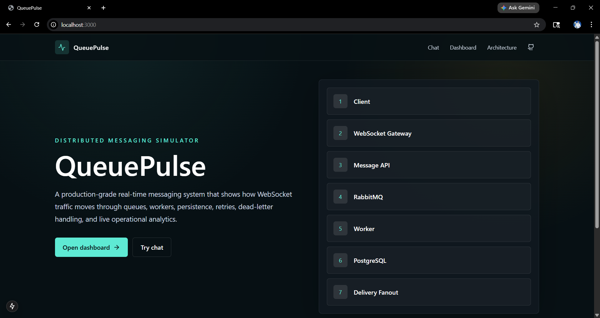
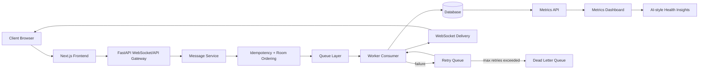

# QueuePulse


QueuePulse is a production-style distributed messaging infrastructure simulator that demonstrates how real-time chat systems such as Slack or WhatsApp handle delivery guarantees, retries, dead-letter queues, and observability.

Unlike basic chat apps, QueuePulse focuses on backend system design:

- WebSocket-based real-time messaging
- Queue-driven message pipeline
- Retry and Dead Letter Queue handling
- Idempotency and ordered delivery
- Metrics and operational dashboard
- AI-style insights over system health

Modes:

- Local Mode: SQLite + in-memory queue for no-Docker demo
- Docker Mode: RabbitMQ + Redis + PostgreSQL + worker for distributed architecture

Demo URLs:

- Chat: http://localhost:3000/chat
- Dashboard: http://localhost:3000/dashboard
- Health: http://localhost:8000/health

Portfolio description: QueuePulse simulates the backend infrastructure behind real-time messaging platforms, focusing on reliability, retry handling, delivery guarantees, and operational visibility.

## Product Preview

<p align="center">
  
</p>

<p align="center"><b>Landing Page</b></p>

<p align="center">
  
</p>

<p align="center"><b>Real-time Chat</b></p>

<p align="center">
  
</p>

<p align="center"><b>Observability Dashboard</b></p>

<p align="center">
  
</p>

<p align="center"><b>System Architecture</b></p>

<p align="center">
  
</p>

<p align="center"><b>Health Check Endpoint</b></p>

<p align="center">
  
</p>

<p align="center"><b>Load Testing</b></p>

These screenshots demonstrate:

- Real-time WebSocket-based messaging
- Queue-based delivery pipeline
- Retry and Dead Letter Queue handling
- Observability dashboard tracking system health and throughput

## Why This Is Not A Normal Chat App

Normal chat apps usually focus on the UI: type a message, send it, and render it on screen. QueuePulse treats chat as the visible edge of a backend infrastructure problem.

The project focuses on reliability, message lifecycle, retries, failure handling, observability, and system design. A submitted message moves through an API gateway, idempotency checks, room-level ordering, queue publication, worker processing, persistence, WebSocket delivery, metrics, and operational insights.

That makes QueuePulse a backend systems project rather than a CRUD chat interface. It demonstrates the kind of infrastructure thinking used to design production messaging platforms.

## Architecture



## Message Lifecycle

1. Client sends a message from `/chat`.
2. FastAPI validates the payload and applies rate limiting.
3. The message service checks `client_message_id` for idempotency.
4. A room-level `sequence_number` is assigned.
5. The message is persisted as `queued`.
6. The queue layer publishes the message event.
7. A worker processes delivery and records delivery attempts.
8. Successful messages become `delivered` and are broadcast through WebSockets.
9. Failed messages go through retry backoff.
10. Messages exceeding max retries are marked `dead_lettered`.

## Delivery Guarantees

QueuePulse models at-least-once delivery. Duplicate client submissions are safe because `client_message_id` is unique per room. Consumers are idempotent: already delivered, read, or dead-lettered messages are not processed again.

## Local Demo Mode

Use this mode when Docker, WSL, RabbitMQ, or Redis are unavailable. Local mode does not require Docker. It uses SQLite and in-memory services, making it good for demos, screenshots, and recruiter walkthroughs.

Backend:

```powershell
cd queuepulse\backend
pip install -r requirements.txt
uvicorn app.main:app --reload --port 8000
```

Frontend:

```powershell
cd queuepulse\frontend
npm install
npm run dev
```

Open:

- http://localhost:3000
- http://localhost:3000/chat
- http://localhost:3000/dashboard
- http://localhost:8000/health

Local mode behavior:

- SQLite replaces PostgreSQL.
- In-memory queues replace RabbitMQ.
- In-memory presence, rate limiting, and runtime controls replace Redis.
- FastAPI starts a background worker to process queued messages.
- Full distributed mode requires Docker.

## Docker Distributed Mode

Docker mode preserves the real distributed architecture.

```bash
docker compose up --build
```

Docker mode:

- Requires Docker Desktop and WSL2 on Windows.
- Uses RabbitMQ, Redis, PostgreSQL, FastAPI, Next.js, and a separate worker.
- Keeps the queue/worker/storage architecture close to a production-style deployment.

On this laptop, Docker may be blocked by WSL issues, but the distributed architecture is preserved in `docker-compose.yml`.

## Demo Flow

1. Start backend.
2. Start frontend.
3. Open two browser tabs at `/chat`.
4. Create or join the same room.
5. Send messages.
6. Open dashboard.
7. Trigger simulation controls.
8. Observe metrics and insights.
9. Capture screenshots.

Detailed walkthrough: [docs/DEMO_SCRIPT.md](docs/DEMO_SCRIPT.md)

## Screenshots Checklist

Capture these files under `screenshots/`:

- `screenshots/landing.png`
- `screenshots/chat-two-tabs.png`
- `screenshots/dashboard.png`
- `screenshots/architecture.png`
- `screenshots/health-endpoint.png`
- `screenshots/load-test.png`

More guidance: [screenshots/README.md](screenshots/README.md)

## API And Observability

Core endpoints:

- `GET /health`
- `GET /api/metrics`
- `GET /api/insights`
- `POST /api/rooms`
- `GET /api/rooms`
- `POST /api/messages`
- `GET /api/messages/{room_id}`
- `POST /api/simulate/failure-rate`
- `POST /api/simulate/worker-delay`
- `POST /api/simulate/load-spike`

Dashboard metrics include throughput, queue depth, retry count, dead-letter count, active users, active rooms, success rate, average delivery latency, failure rate, and recent failed messages.

## System Design Trade-Offs

- RabbitMQ was chosen over Kafka for a cleaner local distributed setup and straightforward retry/DLQ demonstration.
- Redis is used for presence, rate limiting, and shared runtime simulation controls in Docker mode.
- SQLite and in-memory services make local demo mode reliable on laptops without Docker.
- SQLAlchemy sync sessions keep the code readable for review; high-throughput production deployments could move hot paths to async database drivers.
- The dashboard polls metrics for simplicity; production systems could stream metrics or export to Prometheus/Grafana.
- Rule-based insights are deterministic and free; an LLM provider can be added later without changing the dashboard contract.

## Local Mode Limitations

- In-memory queues are single-process and reset on restart.
- In-memory presence, rate limits, and runtime controls reset on restart.
- SQLite replaces PostgreSQL for the local demo path.
- Local mode is ideal for recruiter demos; Docker mode is the full distributed-system profile.

## Resume Bullets

- Engineered QueuePulse, a distributed real-time messaging system using FastAPI, WebSockets, and a queue-based pipeline with retry and dead-letter handling; implemented idempotency, ordered delivery, and a live observability dashboard tracking throughput, latency, and failure rates.

- Designed a dual-mode architecture with local simulation and distributed Docker mode using RabbitMQ, Redis, and PostgreSQL to demonstrate scalable system design concepts and production-grade messaging workflows.

## GitHub Repository Metadata

Recommended repo description:

Distributed real-time messaging system with queues, retries, DLQ, and observability dashboard using FastAPI, WebSockets, and Next.js.

Recommended GitHub topics:

- fastapi
- websockets
- rabbitmq
- redis
- postgresql
- distributed-systems
- system-design
- real-time
- queue
- nextjs
- observability

## Verification

Backend:

```bash
cd backend
pip install -r requirements.txt
python -m compileall app
python -m pytest app/tests
uvicorn app.main:app --reload --port 8000
```

Frontend:

```bash
cd frontend
npm install
npm run build
npm run dev
```

Load test:

```bash
python scripts/load_test.py --users 50 --messages 500 --room demo
```

## Future Improvements

- Add OpenTelemetry traces across API, queue, worker, and WebSocket delivery.
- Add message replay from DLQ with operator approval.
- Add multi-worker consumer groups and per-room partitioning.
- Add auth, encrypted rooms, and per-device read receipts.
- Add Prometheus and Grafana deployment profile.
