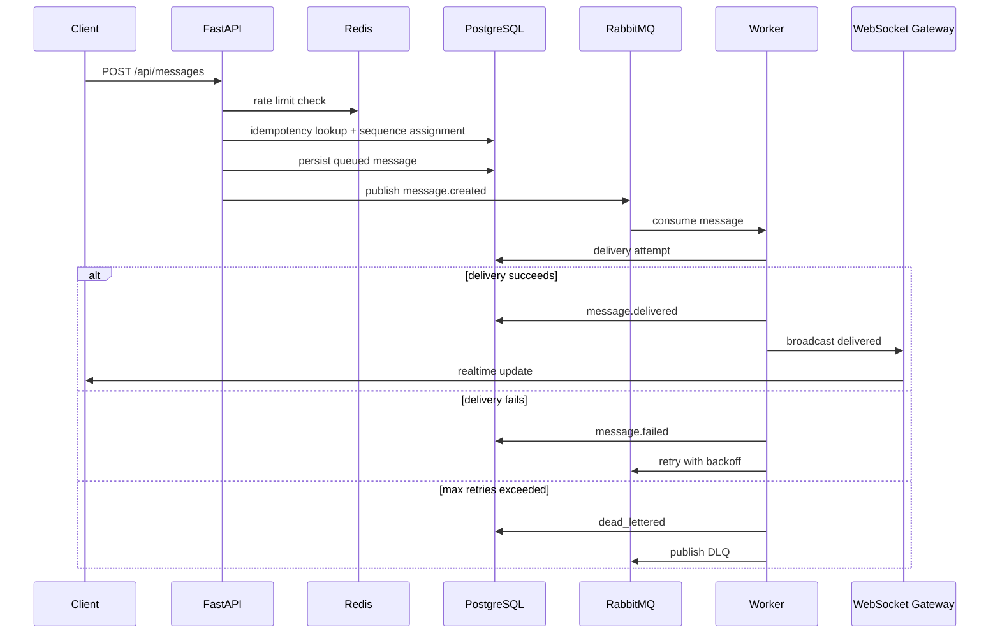

# QueuePulse Architecture

QueuePulse is split into four runtime surfaces:

- Next.js frontend for chat, dashboard, and architecture pages.
- FastAPI API and WebSocket gateway.
- RabbitMQ-backed asynchronous message pipeline.
- Worker consumer that persists delivery attempts and emits message status transitions.

## Runtime Flow

## Core Guarantees

- At-least-once processing through durable queue publication.
- Idempotent producer behavior through `(room_id, client_message_id)`.
- Per-room ordering with `room_sequences`.
- Persisted status history through `message_status_events`.
- Persisted retry audit trail through `delivery_attempts`.

## Observability

The metrics endpoint aggregates operational data from PostgreSQL, Redis, and queue depth estimates. The dashboard presents:

- throughput over time
- average delivery latency
- queue depth trend
- success vs failed messages
- retry and DLQ pressure
- recent failure reasons

## Failure Simulation

Operators can simulate delivery failure percentage, load spikes, and consumer pause/resume from the dashboard.
