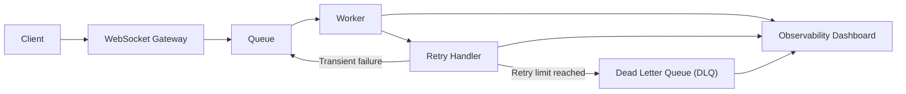

# QueuePulse Architecture Walkthrough

Expected asset:

`docs/architecture/queuepulse-architecture.gif`

## Mermaid Diagram

## Stage Breakdown

- **Client**: sends or receives real-time messages through the chat interface.
- **WebSocket Gateway**: keeps the real-time connection open and forwards work into the backend pipeline.
- **Queue**: decouples ingestion from processing so the system can handle bursts more safely.
- **Worker**: processes queued messages and applies the business logic.
- **Retry Handler**: decides whether failed work should be retried or escalated.
- **Dead Letter Queue (DLQ)**: stores messages that exceeded retry limits or failed permanently.
- **Observability Dashboard**: surfaces queue depth, retries, failed messages, throughput, and health signals.

## Why This Matters

This flow demonstrates that QueuePulse is not just a chat demo. It is designed to show backend reliability patterns: asynchronous processing, retry control, failure isolation, and operational visibility.

## Recording Guidance

If you later record a walkthrough GIF, show this sequence:

1. Open chat view
2. Send a message
3. Show message entering the processing path
4. Open dashboard
5. Show health, throughput, or failure visibility

Keep the walkthrough short and architecture-focused.
